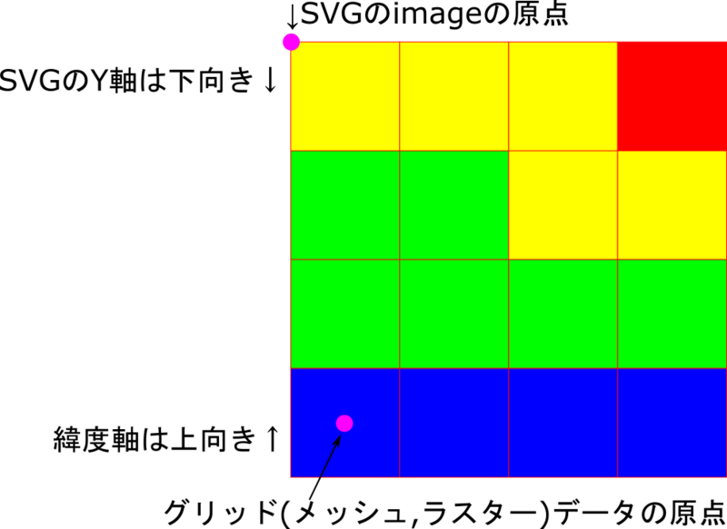

# Tutorial 10: Converting WebApp Layer Mesh Data to Bit Image

## Introduction  {#introduction}

Mesh data (grid data), also known as [raster data](../tutorial-8/index.md#raster), is almost equivalent to bit image data used as web content. Therefore, we will build a web application that dynamically converts mesh data into bit image content (PNG format) and displays it on a map screen. This offers performance advantages.

To actually do it, click on [mesh3.html](https://svgmap.org/examples/tutorials/mesh3/mesh3.html).

### Source Code {#source-code}

- [Source code directory](https://svgmap.org/examples/tutorials/mesh3/)
- [The geoid height data](https://fgd.gsi.go.jp/download/geoid.php) (TEXT data) published by the Geospatial Information Authority of Japan is read using the fetch API and stored in a variable (Object).
- Construct a bit image using the canvas element API.
- Convert it to a dataURI, turn it into an SVG image element, and place it on the map.

## Tutorial {#tutorial}

Mesh data (Grid data),also known as [raster data](../tutorial-8/index.md#raster), is in a format almost identical to the bit image data formats (such as PNG and JPEG) commonly used for web content. Therefore, we will build a web application that dynamically converts mesh data into bit image content (PNG format) and displays it on a map screen. This offers performance advantages.

The distinctive code is found in the webApp linked to the layer.

- [Click here](https://svgmap.org/examples/tutorials/mesh3/mesh3.html) to see how it works.
- The file used is a [ZIP archive file](https://www.svgmap.org/examples/tutorials/mesh3.zip).

### Data to Use {#data-to-use}

We will use the geoid height data (TEXT data) published by the Geospatial Information Authority of Japan on [this page](https://fgd.gsi.go.jp/download/geoid.php).

[Actual data to be used](https://svgmap.org/examples/tutorials/mesh3/gsigeo2011_ver2_1.asc)

The detailed specifications of this data are described in the package documentation (**asc_instruction_sheet.pdf**) distributed on the above website , but it is basically in text [Raster format](../tutorial-8/index.md#raster).

Note that the data format uses spaces as delimiters, not commas, and each Raw (column) does not end on a single line, but rather breaks every 255 characters.

Regarding the data itself, it's important to note the difference between the definition of the grid data's origin and the origin when it's visualized as a bit image. (See the two points below)

- Because the Y (latitude) axis is oriented in the opposite direction, the origin of the original raster data is at the southern end, and the origin of the bit image is at the top end.
- The origin of raster data is the center position of the pixel when it is visualized as a bit image, whereas the origin when positioning a bit image is the upper left corner of the pixel.



[Explination Diagram](https://svgmap.org/examples/tutorials/mesh3/mesh3_raster_exp.svg)

### [mesh3.html](https://svgmap.org/examples/tutorials/mesh3/mesh3.html) {#mesh3-html}

Nothing has changed from before.

### [Container.svg](https://svgmap.org/examples/tutorials/mesh3/Container.svg) {#container-svg}

Nothing has changed from before.

### [rasterMesh.svg](https://svgmap.org/examples/tutorials/mesh3/rasterMesh.svg) {#raster-mesh-svg}

- The WebApp is blank content linked to (rasterMesh.html below).
- This specifies that the webApp window should appear along with the display.
- Nothing has changed from before.

```svg
<?xml version="1.0" encoding="UTF-8"?>
<svg xmlns="http://www.w3.org/2000/svg" xmlns:xlink="http://www.w3.org/1999/xlink" data-controller="rasterMesh.html#exec=appearOnLayerLoad" viewBox="-42.8202042942663, -49.9999999999999, 513.842451531196, 600" property="Local government codes">

<globalCoordinateSystem srsName="http://purl.org/crs/84" transform="matrix(100,0,0,-100,0,0)" />
</svg>
```

### [rasterMesh.html](https://svgmap.org/examples/tutorials/mesh3/rasterMesh.html), [rasterMesh.js](https://svgmap.org/examples/tutorials/mesh3/rasterMesh.js) {#raster-mesh}

This process dynamically generates a bit image using the raster data of the loaded text, and then visualizes it by pasting it onto the associated rasterMesh.svg file.

- ```onload=async function()```
	- ```await buildData()``` Asynchronous function that reads mesh data and saves it to a global variable.
	- ```var duri = buildImage()```
		- Use the specified Canvas element for the task, generate a bit image from the loaded data, and output it as a [dataURI](https://developer.mozilla.org/ja/docs/Web/HTTP/Basics_of_HTTP/Data_URIs).
		- ```canvas.toDataURL()``` The [toDataURL](https://developer.mozilla.org/ja/docs/Web/API/HTMLCanvasElement/toDataURL) method of the canvas object generates a PNG bit image as the DataURL.
	- ```imageGeoArea``` As noted in the [data precautions](../tutorial-10/index.md#data-to-use-data-to-use), we are calculating the area information needed to map the bit image to SVG coordinates.
	- ```buildSvgImage()``` The generated bit image (dataURI) and its region information are used to embed the bit image into the SVG DOM associated with the webApp.
		- ```svgImage``` The DOM (Document object) of the SVG content associated with this web application is predefined.
	- ```svgMap.refreshScreen()``` Once asynchronous loading, data generation, and SVGMap DOM editing are complete, explicitly trigger a redraw to reflect the changes on the screen. ([Reference](https://www.svgmap.org/wiki/index.php?title=%E8%A7%A3%E8%AA%AC%E6%9B%B8#.E5.86.8D.E6.8F.8F.E7.94.BB.E3.81.AE.E5.88.B6.E9.99.90))

rasterMesh.js

```js
// Description:
// MeshData Visualizer.
//
// History:
// 2022/02/14 : 1st rev.

// Global variable to hold the read ASCII data
var geoidGrid=[];
var dataProps;

onload = async function(){
	// Read mesh data and save it to a global variable
	await buildData();
	// Generate a bit image as a dataURI from the loaded data.
	var duri = buildImage(geoidGrid,document.getElementById("geoidCanvas"));
	// Geographic range of the generated image
	// Note that when it becomes an image, the grid points become the centers of the pixels in the image!
	var imageGeoArea={
		lng0: dataProps.glomn - dataProps.dglo/2,
		lat0: dataProps.glamn - dataProps.dgla/2,
		lngSpan: dataProps.nlo * dataProps.dglo,
		latSpan: dataProps.nla * dataProps.dgla
	}
	if ( typeof(svgMap)=="object" ){
		buildSvgImage(duri,imageGeoArea); // Generate SVG content
		svgMap.refreshScreen();
	}
}

async function buildData(){
	var gtxt = await loadText("gsigeo2011_ver2_1.asc");
	
	gtxt = gtxt.split("\n");
	
	dataProps = getHeader(gtxt[0]);
	var gx=0, gy=0;
	var geoidGridLine=[];
	for ( var i = 1 ; i < gtxt.length ; i++){
		var na = getNumberArray(gtxt[i]);
		gx += na.length;
		geoidGridLine = geoidGridLine.concat(na);
		if ( gx >= dataProps.nlo ){
			geoidGrid.push(geoidGridLine);
			geoidGridLine=[];
			gx=0;
		}
	}
}

function buildImage(geoidGrid, canvas){
	//
	screen.width = dataProps.nlo;
	canvas.height=dataProps.nla;
	var context = canvas.getContext('2d');
	var imageData = context.getImageData(0, 0, canvas.width, canvas.height);
	var pixels = imageData.data;
	for ( var py = 0 ; py < dataProps.nla ; py++ ){
		var dy = dataProps.nla - 1 - py
		for ( var px = 0 ; px < dataProps.nlo ; px++ ){
			var base = (dy * dataProps.nlo + px) * 4;
			if (geoidGrid[py][px]!=999){
				
				var hue = (1-(geoidGrid[py][px]-dataProps.minVal)/(dataProps.maxVal-dataProps.minVal))*270;
				var rgb = HSVtoRGB(hue,255,255);
				
				pixels[base + 0] = rgb.r; // Red
				pixels[base + 1] = rgb.g; // Green
				pixels[base + 2] = rgb.b; // Blue
				pixels[base + 3] = 255; // Alpha
			}
		}
	}
	context.putImageData(imageData, 0, 0);
	
	var duri = canvas.toDataURL('image/png');
	return ( duri );
}

function getHeader(line){
	var datas = parseLine(line);
	return {
		glamn:Number(datas[0]),
		glomn:Number(datas[1]),
		dgla:Number(datas[2]),
		dglo:Number(datas[3]),
		nla:Number(datas[4]),
		nlo:Number(datas[5]),
		ikind:Number(datas[6]),
		vern:datas[7],
		minVal:9e99,
		maxVal:-9e99
	}
}

function getNumberArray(line){
	var ans = [];
	var lineArray = parseLine( line );
	for (var col of lineArray){
		var val = Number(col);
		if (val != 999){
			if ( val > dataProps.maxVal){
				dataProps.maxVal = val;
			}
			if ( val < dataProps.minVal){
				dataProps.minVal=val;
			}
		}
		ans.push(val);
	}
	return ( ans );
}

function parseLine(line){
	var ans = line.trim().split(/\s+/)
	return (ans);
}


async function loadText(url){ // Read text data using fetch
	messageDiv.innerText="Loading geoid high data";
	var response = await fetch(url);
	var txt = await response.text();
	messageDiv.innerText="";
	return ( txt );
}

function HSVtoRGB (h, s, v) { // from http://d.hatena.ne.jp/ja9/20100903/1283504341
	var r, g, b; // 0..255
	while (h < 0) {
		h += 360;
	}
	h = h % 360;
	
	// Special case: saturation = 0
	if (s == 0) {
		// → RGB is equal to V
		v = Math.round(v);
		return {'r': v, 'g': v, 'b': v};
	}
	s = s / 255;
	
	var i = Math.floor(h / 60) % 6,
	f = (h / 60) - i,
	p = v * (1 - s),
	q = v * (1 - f * s),
	t = v * (1 - (1 - f) * s);

	switch (i) {
	case 0:
		r = v; g = t; b = p; break;
	Case 1:
		r = q; g = v; b = p; break;
	Case 2:
		r = p; g = v; b = t; break;
	Case 3:
		r = p; g = q; b = v; break;
	Case 4:
		r = t; g = p; b = v; break;
	Case 5:
		r = v; g = p; b = q; break;
	}
	return {'r': Math.round(r), 'g': Math.round(g), 'b': Math.round(b)};
}


// The following functions are effective when run as an SVGMap layer.
var CRSad = 100; // Hardcode the CRS of the svgmap content...
function buildSvgImage(imageDataUri,imageParam){
	//Receives a data URL and pastes the image into the SVGMap content.
	var rct = svgImage.createElement("image");
	rct.setAttribute("x", imageParam.lng0 * CRSad);
	rct.setAttribute("y", -(imageParam.lat0 + imageParam.latSpan) * CRSad);
	rct.setAttribute("width", imageParam.lngSpan * CRSad);
	rct.setAttribute("height", imageParam.latSpan * CRSad);
	rct.setAttribute("xlink:href",imageDataUri);
	rct.setAttribute("style", "image-rendering:pixelated"); // Since it's mesh data, sharpen the pixels of the enlarged image.
	var root = svgImage.documentElement;
	root.appendChild(rct);
}
```